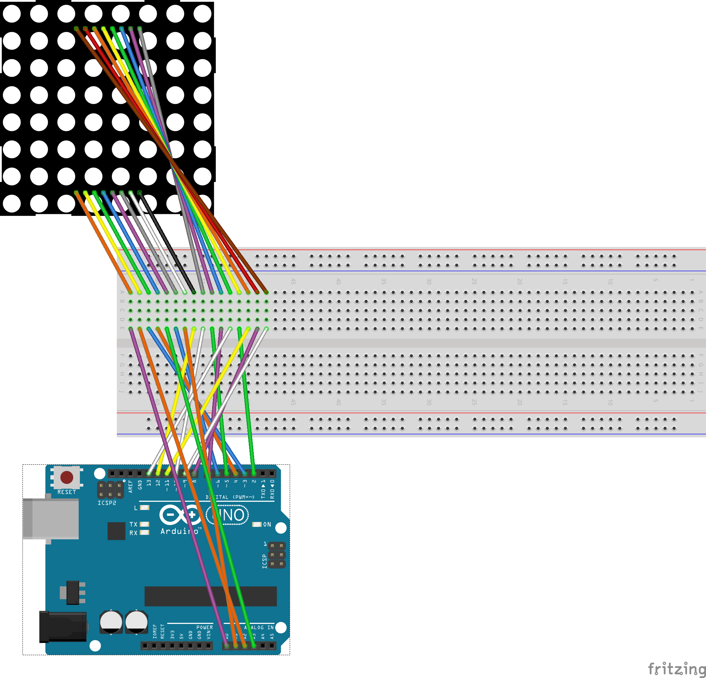

# Eye Animation - Arduino Project

This Eye animation is made in an 8x8 Red Light LED Matrix and an Arduino UNO.

## Table of Contents
- [Introduction](#introduction)
- [Features](#features)
- [Materials](#materials)
- [Circuit Diagram](#circuit-diagram)

## Introduction

This project serves as a practical demonstration of a short, realistic eye animation within an 8x8 LED matrix.

## Features

- Eye animation on an 8x8 Red Light LED Matrix.
- Arduino UNO powered.
- Common Cathode LED Matrix.

## Materials

- Arduino UNO
- 8X8 Red Light LED Matrix (Common Cathode)
- Breadboard
- Jumper Wires

## Circuit Diagram

Diagram:

To connect the Matrix and the Arduino Uno, Follow this table:

| MATRIX  | 13 | 3 | 4 | 10 | 6 | 11 | 15 | 16 | 9  | 14 | 8  | 12 | 1  | 7  | 2  | 5  |
|---------|----|---|---|----|---|----|----|----|----|----|----|----|----|----|----|----|
| ARDUINO | 2  | 3 | 4 | 5  | 6 | 7  | 8  | 9  | 10 | 11 | 12 | 13 | A0 | A1 | A1 | A3 |

